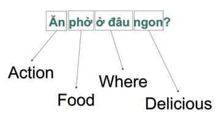
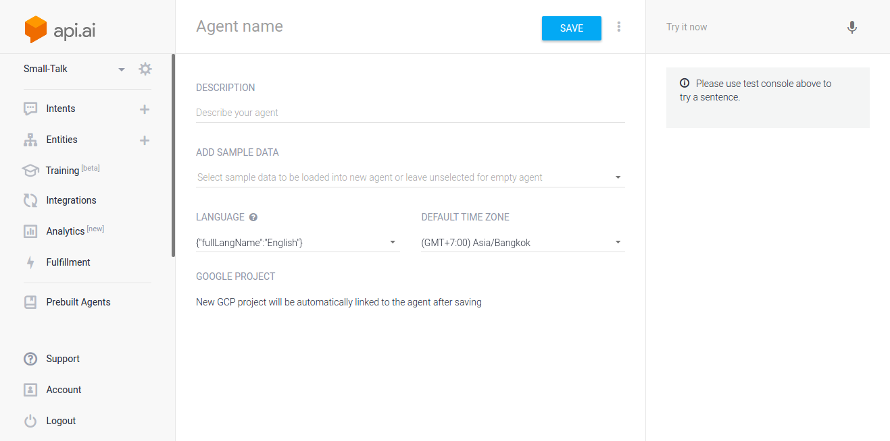
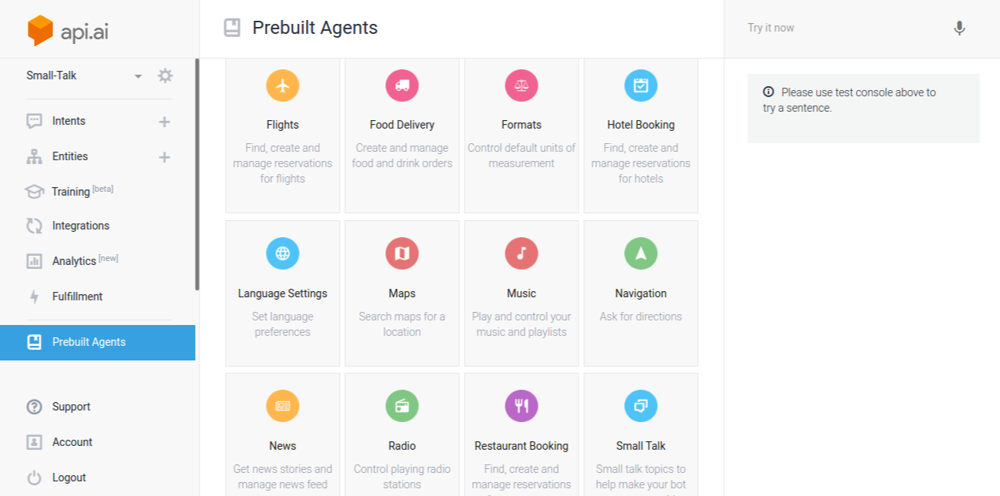
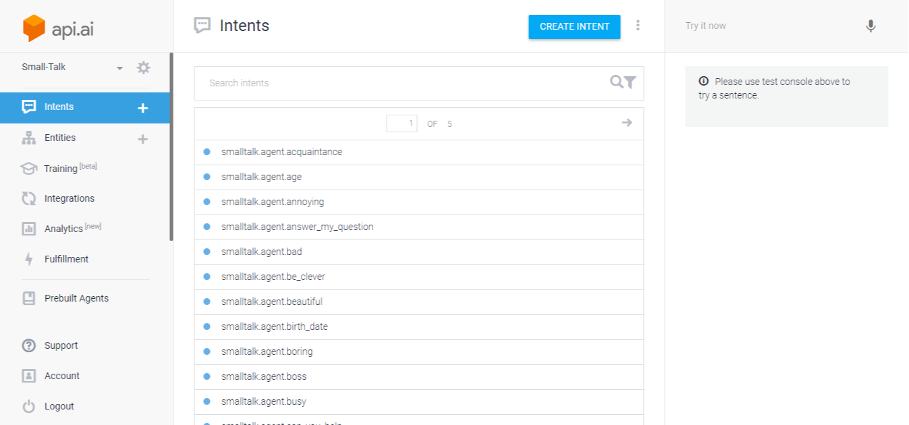
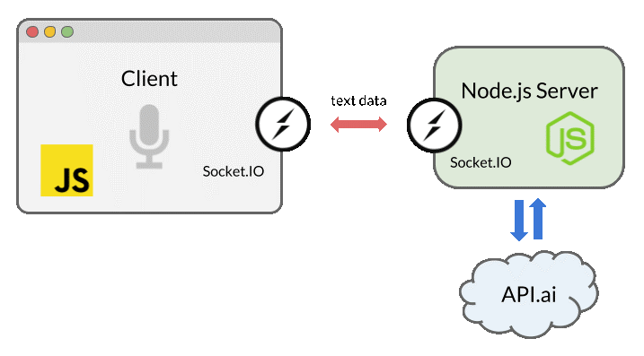

<p align="center"></p>

<p align="center">
<a href="https://speakaibot.herokuapp.com/"></a>
</p>

#### Thành viên trong nhóm <br>
- Tô Mạnh Hiệp
- Nguyễn Văn Tuệ


## Giới thiệu về Xử lý ngôn ngữ tự nhiên (Natural Language Processing) và công nghệ tích hợp xử lý ngôn ngữ tự nhiên API.AI

Mục đích: Chủ đề này giới thiệu về Xử lý ngôn ngữ tự nhiên  – một phương pháp mới để giúp cho máy có thể hiểu và phân tích được câu nói của con người và có thể chắc lọc ra những thông tin cần thiết. Bên cạnh đó, chủ đề này còn giới thiệu về công nghệ API.ai – công nghệ xử lý ngôn ngữ tự nhiên và giúp lập trình viên tương tác trao đổi thông qua RESTful Web Services.


- Trang chủ [API.AI](https://dialogflow.com/) (Mới đổi tên thành  Dialogflow) .
- Tài liệu [api.ai/docs](https://dialogflow.com/docs/getting-started/basics).


## Khái niệm về Xử lý ngôn ngữ tự nhiên (NLP)

Xử lý ngôn ngữ tự nhiên - [Natural Language Processing (NLP)](https://en.wikipedia.org/wiki/Natural_language_processing) – là một nhánh của trí tuệ nhân tạo, tập trung vào việc tương tác giữa máy tính và ngôn ngữ tự nhiên của con người, để từ đó máy tính có thể hiểu và thực thi đúng yêu cầu của con người.

Vậy làm thế nào để máy tính có thể hiểu được câu nói của con người?

Sau đây, tôi sẽ hướng dẫn các bạn cách giúp máy tính hiểu được ngữ nghĩa của một câu nói.

Đầu tiên chúng ta có một vài khái niệm:

**1. Lexical Category** – Nhóm từ vựng học.

- Khái niệm này giúp định danh cho một tập các từ hoặc cụm từ cùng mang một ý nghĩa hay đề cập đến một nội dung cụ thể.
- Khái niệm này giúp chúng ta có thể phân tích các thành phần trong một câu thành dạng tổng quát để có người khác có thể diễn đạt bằng nhiều cách hay sử dụng từ địa phương, từ lóng, … thì nó cũng cùng chung một ngữ nghĩa.
- Ví du: Food là một Lexical Category bao gồm các từ như bún bò, hủ tiếu, …

- Để hiểu rõ khái niệm này, chúng ta cùng phân tích một câu hỏi đơn giản như sau:

[](# "Ví dụ")

Câu hỏi trên được phân tích thành các Lexical Category như sau

[](# "Lexical Category")\

+ Action: dùng để chỉ các hành động của con người có liên quan tới thức ăn.
+ Food: dùng để chỉ các món ăn.
+ Where: dùng để xác định các từ để hỏi địa điểm.
+ Delicious: là tập hợp các từ chỉ độ ngon của thức ăn.
+ …: các lexical category khác tùy theo sự phức tạp của của một câu được phân tích

Từ câu ví dụ trên chúng ta có thể gom lại thành một chuỗi các Lexical Category như sau:
**[Action][Food][Where][Delicious]**

**2. Pattern** – cú pháp hay ngữ pháp hình thành trong một câu.

- Vi dụ:  [Action][Food][Where][Delicious].
  => Mục đích của pattern giúp xác định mẫu câu được dùng trong giao tiếp.

Đến đây, chúng ta đã hình thành nên khái niệm mẫu câu, ngữ pháp của câu để sử dụng trong giao tiếp và truyền đạt theo kiểu chúng ta được học trong ngôn ngữ tiếng Việt hay tiếng Anh.

Tuy nhiên, ngôn ngữ tự nhiên được hiểu theo ngữ cảnh – các câu giao tiếp có ý nghĩa khác nhau tùy theo không gian, địa điểm và nội dung đang được trao đổi, và không theo một một quy tắc nào. Vì vậy, pattern chưa đảm bảo việc xác định chính xác nghĩa một câu.

**3. Intent** – xác định ý định, hay mục đích của câu được phân tích dựa trên ngữ cảnh giao tiếp.

- Ví dụ:  với câu hỏi “**Ăn phở ở đâu ngon?**”, chúng ta hiểu intent “câu nói mong muốn xác định vị trí quán phở ở đâu là ngon”.

**Tổng kết:** muốn xử lý ngôn ngữ tự nhiên chúng ta cần phải xác định 03 thành phần cơ bản lần lượt là Lexical Category, Pattern, Intent để thông qua đó chúng ta sẽ dạy cho máy hiểu được các câu được chuyển tải trong quá trình giao tiếp.

## API.ai

**1. Giới thiệu và tính năng**
- Api.ai là một framework hỗ trợ xử lý ngôn ngữ tự nhiên (hiện tại, bộ này chưa hỗ trợ tiếng Việt) nhằm hỗ trợ người lập trình xây dựng một công cụ liên quan đến giao tiếp tự động giữa người và máy tính.
- Các tính năng:
  + Api.ai’s Speech Recognition: Hỗ trợ nhận diện giọng nói, chuyển đổi âm thanh – sound thành dạng văn bản – text.
  + Natural Language Understanding and Conversation Management: Xử lý ngôn ngữ tự nhiên và hỗ trợ giao tiếp.

**2. Một số khái niệm cơ bản trong API.ai sử dụng**

| **Khái niệm** |                **Mô tả**                 |
| :-----------: | :--------------------------------------: |
|     Agent     | Tương đương như một ứng dụng trong api.ai. Đây cũng là nơi chúng ta tích hợp vào ứng dụng của mình để có thể dạy và test bot. |
|    Entity     | Khái niệm tương tự như Lexical Category đã nói trên. |
|    Intent     | Xác định ngữ cảnh của câu và ứng xử trong giao tiếp. Có ý nghĩa tương tự như phần giải thích về intent trên |
|    Action     | Khi một intent được trigger thì action sẽ được thực hiện. Action đỏi hỏi các thông tin (parameter) tương ứng được tổng hợp từ các pattern kết hợp với các intent. |
|    Context    | Xác định ngữ cảnh của câu được phân tích hay giao tiếp. Context bao gồm các intent, cho biết các câu nói đó thuộc những ngữ cảnh tương ứng để có cách ứng xử cho phù hợp. |

- Đọc thêm [Basics Documentation](https://dialogflow.com/docs/getting-started/basics)

**3. Cách sử dụng**
Chúng ta có thể tích hợp api với ứng dụng của chúng ta bằng cách sử dụng REST-like API.

- Đọc thêm về [API](https://vi.wikipedia.org/wiki/Giao_di%E1%BB%87n_l%E1%BA%ADp_tr%C3%ACnh_%E1%BB%A9ng_d%E1%BB%A5ng) 
- Đọc thêm về [REST or RESTFUL](https://en.wikipedia.org/wiki/Representational_state_transfer)


## Hướng dẫn chi tiết sử dụng API.AI 

**1. Create Agent**



- Prebuilt Agent (Một số Agent API.AI xây dựng sẵn theo các tính năng nhất định như đặt vé, hội thoại, ...)



**2. Create Intents**



- Intent Contexts


- Intent Responses


## Ứng dụng

**1. Thiết kế**


Mô tả : Để xây dựng ứng dụng giao tiếp, nói chuyện với Bot, ta thực hiện các bước sau:

- Sử dụng công nghệ nhận dạng giọng nói để chuyển lời nói thành văn bản (Speech to text).
- Đoạn văn bản này được gửi lên API.AI để xử lý, sau đó trả về hội thoại tương ứng với lời người nói (Bot đã được chúng ta dạy các đoạn hội thoại).
- Văn bản (text) sau khi trả về thông qua công nghệ tổng hợp giọng nói (Text to speech) giao tiếp với người nói.

**Actor**

- Người dùng.
- Bot.
- API.AI (Hệ thống khác).

**Chức năng chính**

- Giao tiếp, hội thoại tiếng Anh với Bot
- Ngoài ra: Kiểm tra phát âm với Bot, Luyện từ vựng với Bot.


**2. Xây dựng hệ thống**



**Công nghệ sử dụng**

- Server được xây dựng bằng Node JS và Socket.IO (để xây dựng ứng dụng realtime).

  Tìm hiểu thêm về [Node JS](https://nodejs.org/en/)

  Tìm hiểu thêm về [Socket.IO](https://socket.io/)

- Client sử dụng công nghệ Web Speech API để nhận dạng giọng nói (SpeechRecognition - Speech to text) và tổng hợp giọng nói (SpeechSynthesis - Text to speech).

  - Nhận dạng giọng nói - Được sử dụng thông qua `SpeechRecognition interface`, nó cung cấp khả năng nhận dạng ngôn ngữ từ âm thanh và trả về những nhận dạng thích hợp nhất.

    Nói chung, bạn sẽ tạo một đối tượng `SpeechRecognition`, nó có sẵn một số bộ xử lý sự kiện để phát hiện khi nào giọng nói được nhập thông qua micrô của thiết bị. `SpeechGrammar interface` chứa một bộ ngữ pháp cụ thể mà ứng dụng của bạn cần nhận ra. Ngữ pháp được định nghĩa bằng cách sử dụng `JSpeech Grammar Format` (JSGF).

  - Tổng hợp giọng nói - Được sử dụng thông qua `SpeechSynthesis interface`, nó cho phép các chương trình có thể "đọc" các đoạn văn bản mà chúng ta cung cấp.
    Bạn có thể sử dụng hay thay đổi các loại giọng nói khác nhau được cung cấp thông qua object `SpeechSynthesisVoice`.

  - Web Speech API là hoàn toàn miễn phí và được tích hợp trong các trình duyệt đời mới nên bạn có thể thoải mái sử dụng.

  - Tìm hiểu thêm về [Web Speech API](https://developer.mozilla.org/en-US/docs/Web/API/Web_Speech_API)

- API.AI - Platform trung gian xử lý ngôn ngữ  tự nhiên và AI.


**3. Cài đặt và sử dụng ứng dụng**

**Server**

- Cài đặt NodeJS

  ```
   $ curl -sL https://deb.nodesource.com/setup_8.x | sudo -E bash -
   $ sudo apt-get install -y nodejs
   $ sudo apt-get install -y build-essential
  ```


- Cài đặt server (Sử dụng framework Express) và các module cần thiết (Socket io, api.ai, ...)

  ```
   $ git clone https://github.com/truonganhhoang/int3507-2017.git
   $ cd Nhom 10/chatbot
   $ npm install
  ```

- Chạy server 

  ```
   $ npm start
  ```

  Mặc định server chạy ở [http://127.0.0.1:3000](http://127.0.0.1:3000/)


**Hình ảnh demo**

Update...


### Demo Heroku

- [CHATBOT](https://speakaibot.herokuapp.com/) (Hội thoại tiếng Anh với AI Bot)
- [PRONUNCIATION CHECKER](https://speakaibot.herokuapp.com/pronunciation) (Kiểm tra phát âm tiếng anh với AI Bot)
- [VISION DETECT](https://speakaibot.herokuapp.com/vision) (Học từ vựng qua hình ảnh với AI Bot)


### Slide GitPitch 
- https://gitpitch.com/hieptm96/slidechatbot


### Docs

- [API.AI docs](https://api.ai/docs/getting-started/basics)